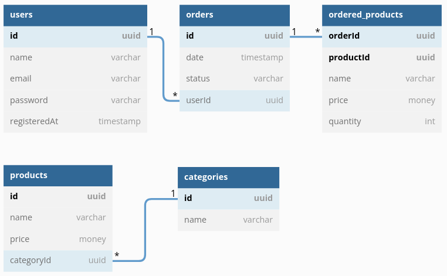

# Выполненные задания

### Запуск
`npm start` - обычный запуск

`npm run dev` - запуск в режиме разработки

### Источник данных
Источником данных является набор фейковых данных, которые генерируются один раз при запуске проекта. Структура данных эмулирует структуру базы данных, указанную ниже на рисунке

> ПРИМЕЧАНИЕ: Между categories и ordered_products нет связи, так как в ordered_products хранятся копии данных.

### Что реализовано
Получение данных: **users, oredrs, ordered_products**

Изменение дванных (создание, обновление, удаление) данных: **users, products**
